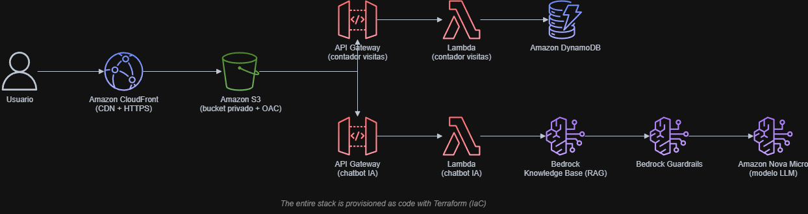

# Cloud Resume Challenge + AI (Bedrock)


**[Live Demo](https://tatan461.github.io/cloud-resume-ai/)** · **[LinkedIn](https://linkedin.com/in/jonathan-angel-gonzalez-0543b441a)** · **[GitHub](https://github.com/tatan461)**

Professional portfolio combining a high-performance static resume with a conversational AI assistant (RAG) capable of answering questions about my background and projects. The full AWS architecture is designed and provisioned as code with Terraform; the frontend is currently deployed via GitHub Pages, while the serverless backend — including the AI chatbot — runs entirely on AWS, deployed through a GitHub Actions CI/CD pipeline authenticated via OIDC.

**Author:** Jonathan Ángel González — Junior Cloud Engineer

[](https://www.credly.com/badges/acb43683-5fc4-49c8-821f-7a49d90f2c74)
[](https://www.credly.com/badges/4bea0010-dd3b-4433-be2c-d2b46f1915d0)
[](https://linkedin.com/in/jonathan-angel-gonzalez-0543b441a)
[](https://github.com/tatan461)

---

## Contents

- [Why this project](#why-this-project)
- [Live demo](#live-demo)
- [See it in action](#see-it-in-action)
- [Architecture](#architecture)
- [Project phases](#project-phases)
- [Architecture decisions](#architecture-decisions)
- [Tech stack](#tech-stack)
- [How to deploy](#how-to-deploy-wsllinux)
- [Estimated cost](#estimated-cost)
- [Lessons learned](#lessons-learned)
- [Roadmap](#roadmap)

---

## Why this project

This repository is my implementation of the [Cloud Resume Challenge](https://cloudresumechallenge.dev/), extended with an Amazon Bedrock-powered chatbot. The goal is to demonstrate, with real and documented infrastructure, the skills behind my **[AWS Solutions Architect – Associate](https://www.credly.com/badges/acb43683-5fc4-49c8-821f-7a49d90f2c74)** and **[AWS AI Practitioner](https://www.credly.com/badges/4bea0010-dd3b-4433-be2c-d2b46f1915d0)** certifications: serverless architecture design, security, high-availability networking, generative AI, and infrastructure automation.

## Live demo

**Site:** [tatan461.github.io/cloud-resume-ai](https://tatan461.github.io/cloud-resume-ai/)

<!-- Optional: add a screenshot of the homepage once available

-->

## See it in action

The chat widget on the site is backed by a real Bedrock RAG pipeline, not a scripted response. Sample exchange:

**User:** "What AWS experience does Jonathan have?"

**Assistant:** "Jonathan holds the AWS Solutions Architect – Associate and AWS AI Practitioner certifications, and built this entire project's infrastructure — S3, CloudFront, Lambda, API Gateway, DynamoDB, and Bedrock — as code with Terraform, deployed through a GitHub Actions pipeline authenticated via OIDC."

Ask it anything about the projects, certifications, or the stack itself — off-topic questions are filtered out by Bedrock Guardrails.

## Architecture



**Flow summary:**

User → CloudFront (CDN + HTTPS) → S3 (static site, private bucket with OAC), which branches into:

- API Gateway → Lambda (visit counter) → DynamoDB
- API Gateway (rate-limited) → Lambda (AI chatbot) → Bedrock Guardrails → Bedrock Knowledge Base (RAG, S3 Vectors) → Amazon Nova Micro model

This CloudFront + S3 path is the production-ready design, fully defined in the `frontend` Terraform module. The site currently live at the demo link above runs on GitHub Pages instead (see [Architecture decisions](#architecture-decisions) for why), while the visit-counter and chatbot backends already run on AWS exactly as diagrammed. The entire backend stack is defined as code and deployed via Terraform through a GitHub Actions pipeline, with no resources created manually through the AWS Console and no static AWS credentials stored anywhere in the repository.

## Project phases

- [x] **Phase 1** — Static frontend (S3 + CloudFront + ACM + Route 53 module, currently served via GitHub Pages)
- [x] **Phase 2** — Visit counter backend (API Gateway + Lambda + DynamoDB)
- [x] **Phase 3** — Full migration to Terraform
- [x] **Phase 4** — CI/CD with GitHub Actions (OIDC authentication, no static credentials)
- [x] **Phase 5** — AI chatbot with Bedrock Knowledge Base + Guardrails
- [x] **Phase 6** — Chat widget on the frontend, with API Gateway rate limiting to prevent abuse

All six core phases of the challenge are complete. The items in [Roadmap](#roadmap) below are optional extensions, not unfinished phases.

## Architecture decisions

- **Private S3 bucket + Origin Access Control (OAC):** avoids exposing the bucket directly; only CloudFront can read it.
- **HTTP API in API Gateway** instead of REST API: simpler and cheaper for this use case.
- **Amazon Nova Micro model in Bedrock:** the most cost-effective option in the Nova family ($0.035 per million input tokens, $0.14 per million output tokens), sufficient for a portfolio RAG chatbot.
- **Bedrock Guardrails:** prevents the chatbot from answering off-topic questions or leaking sensitive information.
- **OIDC authentication in GitHub Actions:** no static AWS credentials stored as secrets; the trust policy scopes `AssumeRoleWithWebIdentity` to this exact repo on the `main` branch only.
- **API Gateway rate limiting on the chatbot endpoint:** throttles requests to prevent abuse and keeps Bedrock token spend predictable.
- **Custom prompt template for the chatbot:** tuned for short, conversational answers instead of long generic LLM responses.
- **GitHub Pages for the current frontend deployment:** zero cost and zero billing risk for static hosting while job-hunting. The S3 + CloudFront + Route 53 module stays fully written and ready in Terraform for when a custom domain is worth the roughly $1–2/month it adds.

## Tech stack

**Cloud & IaC**


**Generative AI**


**CI/CD & Languages**


## How to deploy (WSL/Linux)

```bash
# Backend: OIDC provider + IAM role for GitHub Actions
cd infra/backend
terraform init
terraform plan
terraform apply

# Frontend: static site hosting
cd ../frontend
terraform init
terraform plan
terraform apply

# Chatbot: Lambda + API Gateway + Bedrock Knowledge Base + Guardrails
cd ../chatbot
terraform init
terraform plan
terraform apply
```

> Requires AWS credentials configured locally (`aws configure`) and IAM permissions for S3, CloudFront, Lambda, API Gateway, DynamoDB, and Bedrock.

## Estimated cost

| Component | Approximate cost |
|---|---|
| GitHub Pages (current frontend) | $0 |
| S3 + CloudFront + Route 53 (if/when adopted) | A few cents/month with low traffic |
| Lambda + API Gateway + DynamoDB | Covered by the free tier in most cases |
| Bedrock (Nova Micro) | $0.035 per million input tokens / $0.14 per million output tokens — pay-per-use; a CloudWatch billing alarm and a monthly AWS Budget are configured for this project |

## Lessons learned

- **Cost-consciousness matters as much as architecture.** Before deploying anything, I compared the real monthly cost of S3 + CloudFront + Route 53 against GitHub Pages. The AWS stack is cheap (roughly $1–2/month), but as a job-seeking junior engineer, starting at $0 with GitHub Pages removed any billing risk while I kept building — the Terraform module for the AWS stack stayed ready to apply later.
- **Domain registrar pricing has hidden traps.** Comparing registrars taught me that "cheap first year" prices (Namecheap, GoDaddy) often hide renewal costs 2–3x higher; flat-rate registrars like Cloudflare or Porkbun are cheaper over a 5-year horizon even if the first-year price looks less attractive.
- **Diagrams-as-code beats ASCII art.** Switching the architecture diagram from a plain-text flow to a `.drawio` file with official AWS icons made the README noticeably more professional and easier to scan for recruiters.
- **OIDC trust policies fail silently and specifically.** A `sub` claim scoped to `refs/heads/main` will reject pull requests, tags, and manual `workflow_dispatch` runs from other branches with a plain `AccessDenied` — worth testing the exact trigger you'll use in production before assuming the role is broken.
- **Terraform state ordering matters during partial failures.** When an `apply` fails midway (e.g. a duplicate OIDC provider), later resources that depend on the failed one are simply never created — `terraform state list` is the fastest way to confirm what actually exists versus what the code expects.

## Roadmap

The core Cloud Resume Challenge is complete end-to-end: static frontend, visit counter, full Terraform migration, OIDC-based CI/CD, and an AI chatbot backed by Amazon Bedrock with Guardrails, RAG, and API Gateway rate limiting.

Possible next steps if the project keeps evolving:

- [ ] CloudWatch alarms for chatbot latency and error rate
- [ ] Automated chatbot tests inside the CI/CD pipeline
- [ ] SQS-based async processing for higher chatbot throughput
- [ ] A Kubernetes-based project to round out the cloud/DevOps skill set

---

*Portfolio project — Junior Cloud Engineer / AWS Solutions Architect Associate + AI Practitioner.*
